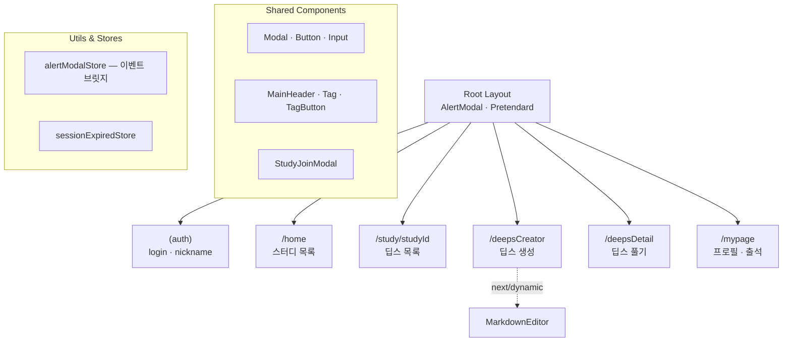

 
 

  
  
  

 
 

## 📚 서비스 소개

**Deeps**는 파편화된 스터디 방식을 벗어나 출제와 풀이에만 집중할 수 있도록 돕는 **퀴즈 기반 스터디 플랫폼**입니다.

많은 모임이 카카오톡과 노션으로 운영되지만, 기록이 쉽게 묻히고 정답이 노출되거나 타이머·인터랙션 기능이 없어 효과적인 퀴즈 진행에 한계가 있었습니다.
Deeps는 이런 불편함을 개선하고, 효율적인 학습 환경을 제공합니다.

- **통합 관리**: 대화 속에 묻히는 기록과 분산된 페이지를 한곳에 모아 체계적으로 아카이빙합니다.
- **출제-풀이 역할 분리**: 정답 및 해설 사전 노출을 방지해 시험 환경을 보장합니다.
- **학습 인터랙션**: 시간별 정답 공개, 힌트 제공 등 퀴즈 진행에 최적화된 동적 기능을 지원합니다.

 
 

## 🔍 주요 기능

### 스터디 생성 및 참여 관리

- **스터디 생성** : 스터디 제목, 기간, 태그를 필수로 입력하고, 스터디에 대한 설명과 비밀번호는 선택하여 입력할 수 있습니다.

- **스터디 정보 확인** : 스터디 카드를 클릭하면 스터디 정보를 확인할 수 있습니다.
- **스터디 입장** : 입장하기 버튼을 클릭하면 스터디에 입장할 수 있습니다. (스터디 상세화면으로 이동합니다.)
- **스터디 상세 화면** : 진행중인 / 완료된 문제 목록과 멤버별 활동 기록, 좋아요 랭킹을 확인할 수 있습니다.

 

### 딥스 목록

- **진행 여부 필터링** : 제한 시간 종료 전과 후로 필터링하여 목록을 보여줍니다.
- **답변 여부** : 진행 중인 딥스에 유저가 답변을 했는지, 하지 않았는지 보여줍니다.

  
  &nbsp;&nbsp;
  

 

### 딥스(문제) 출제 및 에디터

- **딥스 출제** : 딥스 제목, 설명, 제한 시간, 해설을 필수로 입력하고, 힌트를 선택하여 입력할 수 있습니다.
- **에디터** : 딥스 설명과 해설을 입력하는 에디터에는 코드 블럭과 첨부파일을 추가할 수 있습니다.

 

### 딥스 답안 제출

- **퀴즈 풀이** : 진행중인 딥스를 클릭하여, 풀이를 작성할 수 있습니다.
- **에디터** : 풀이 과정에도 코드 블럭과 첨부파일을 추가할 수 있습니다.
- **수정하기** : 답변 등록 후, 제한 시간 이내에 답변을 수정할 수 있습니다.

 

### 멤버 답안 확인 및 피드백

- **멤버 답안 확인** : 제한 시간이 종료된 딥스를 클릭하여, 다른 멤버의 답안과 딥스 해설, 내 답안을 비교할 수 있습니다.
- **멤버 답안 좋아요** : 다른 멤버의 답안이 마음에 든다면 좋아요 버튼을 클릭할 수 있습니다.

### 멤버 초대
- **초대링크 복사** : 스터디 상세화면에서 `스터디 링크 복사` 버튼을 클릭하면 스터디 초대 링크가 클립보드에 복사됩니다.
- **스터디 참여** : 공유 받은 초대 링크를 입력창에 입력하면, 초대하기 팝업이 나타나고, 스터디에 참여할 수 있습니다. 

 

### 프로필 관리
- **대시보드** : 헤더의 프로필을 클릭하면 대시보드 페이지로 이동할 수 있습니다. 출석 현황, 로그아웃, 회원탈퇴 등을 할 수 있습니다.
- **닉네임 변경** : 닉네임을 변경할 수 있습니다.

 
 

## 🎨 디자인 및 UI 시스템

- **Typography**: Pretendard
- **Color System**: Deeps 메인 포인트 컬러 (`#149F37`)

 
 

## 🛠️ 기술 스택 및 아키텍처

### 기술 스택

 

 

 

### 폴더 및 전체 흐름 구조

### 시스템 아키텍처

